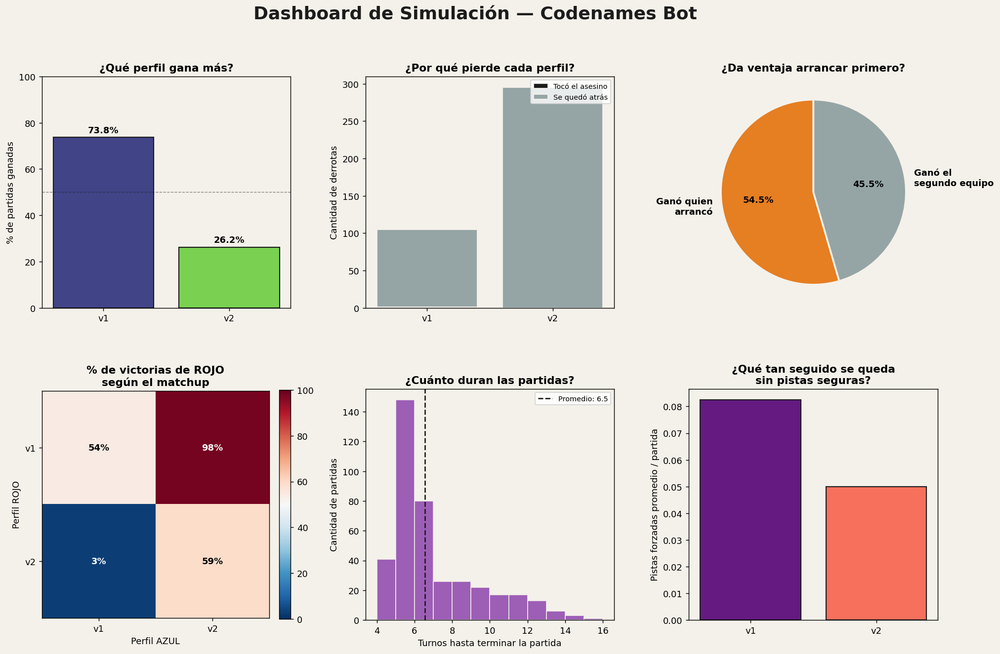
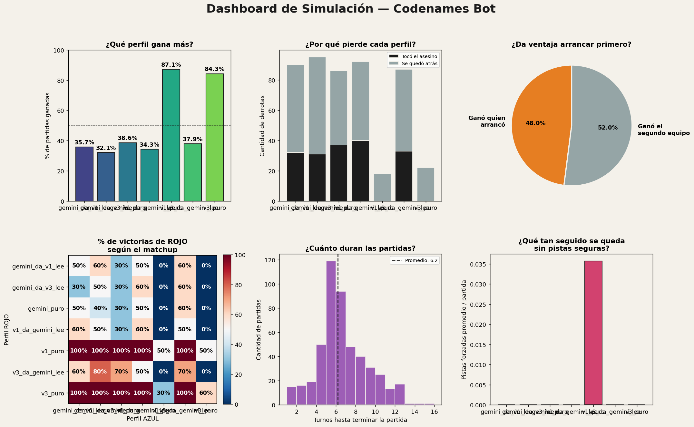

# Nota técnica: un bot de Código Secreto en español, embeddings vs. LLMs

**Autor:** Ian Bounous
**Repositorio:** [github.com/ianbounos/codenames-bot](https://github.com/ianbounos/codenames-bot)

## Resumen

Construimos un bot de Código Secreto (Codenames) en español que da y
decodifica pistas usando embeddings de palabras, y comparamos varias
arquitecturas —desde un modelo simple hasta un ensamble ponderado de
varios modelos y, finalmente, la API de Gemini— en más de 2.000 partidas
simuladas. El hallazgo principal: los bots basados en embeddings
estáticos, con un margen de seguridad calculado matemáticamente, casi
nunca pierden por tocar la carta "asesino". Un LLM (Gemini), pese a
razonar con instrucciones explícitas de seguridad, la toca en más de un
tercio de sus partidas — y el patrón sugiere que el problema no es
descuido, sino un desajuste real entre cómo un LLM "entiende" la
cercanía semántica y cómo la miden los embeddings estáticos.

## Motivación

Este proyecto arrancó como un ejercicio de aprendizaje: usar Codenames
como excusa para practicar desarrollo de software desde cero (Python,
Git/GitHub, entornos virtuales) y conceptos de NLP/embeddings de forma
aplicada. El objetivo no fue construir el mejor bot de Codenames posible
(ya existe investigación previa sobre esto en inglés), sino entender
bien cada pieza, iterando con datos reales en cada paso.

## Arquitectura del sistema

### El motor de juego

Un tablero de 25 cartas (proporción estándar 9/8/7/1: equipo que
arranca / rival / neutrales / asesino), con reglas estándar de
Codenames: el equipo que da la pista puede intentar hasta `N+1` cartas
(el número dicho más una de "regalo"); tocar una carta ajena o neutral
corta el turno; tocar el asesino termina la partida en el acto.

### Cómo da pistas el Spymaster

Para cada palabra candidata del vocabulario (miles de palabras, no solo
las del tablero), se calcula:

- La similitud con cada palabra propia (para encontrar cuántas puede
  conectar de una vez)
- La similitud máxima contra el asesino y contra las palabras
  enemigas/neutrales (el "peligro")

Una pista es válida si el margen entre la palabra propia más floja del
grupo y el peligro más cercano supera un umbral mínimo (`β`), evaluado
**por separado** para el asesino (`β_asesino`) y para el resto
(`β_resto`) — porque tocar el asesino es un error fatal, y tocar una
enemiga solo cuesta el turno.

### Cómo decodifica el Operative

Ordena todas las palabras visibles del tablero por similitud a la
pista, y toca las primeras `N` (por defecto, sin arriesgar el intento
extra).

## Iteración: v1 → v2 → v3

### v1 — spaCy solo

El modelo base: embeddings de `es_core_news_md` (spaCy) combinados con
una lista de frecuencia de ~50.000 palabras en español, para tener
candidatas de pista realistas más allá del vocabulario del tablero.

### v2 — veto estricto (doble validación)

Hipótesis: si un segundo modelo de embeddings (`sentence-transformers`,
arquitectura Transformer, entrenamiento distinto a spaCy) tiene que
**también** aprobar la pista con sus propios márgenes, deberíamos
filtrar asociaciones "raras" que un solo modelo esté alucinando.

**Resultado (400 partidas, v1 vs v2):** v1 le ganó a v2 el **98.3%** de
las veces. v2 casi nunca tocaba el asesino, pero perdía por ser
demasiado lento (**10.0 turnos promedio**, contra **4.8** de v1) — el
veto estricto exigía consenso total entre los dos modelos para conectar
cada palabra, lo que en la práctica lo volvía excesivamente conservador
(pistas de N=1 o N=2 casi siempre, en vez de aprovechar conexiones de 3
o 4 palabras).



### v3 — ensamble ponderado

En vez de exigir que **todos** los modelos aprueben individualmente
(veto), promediamos sus similitudes con pesos, aplicando un
"encogimiento por cobertura": si solo una fracción de los modelos (por
peso) conoce una palabra, el resultado se atenúa hacia cero
proporcionalmente, en vez de descartarla de plano o confiar en ella al
100%.

**Resultado (1.250 partidas, 5 configuraciones):** v3 mejoró mucho
sobre v2 (**59.4%** de winrate contra el 21% de v2), pero no alcanzó a
v1 (**74.8%**). El promedio ponderado, aunque menos restrictivo que el
veto, sigue "diluyendo" conexiones fuertes que un solo modelo (v1)
aprovecha al máximo.

## Integración de un LLM (Gemini)

Además de comparar embeddings entre sí, integramos `gemini-3.1-flash-lite`
(vía API) como Spymaster y Operative alternativos, con la misma interfaz
que los bots locales — dando o decodificando pistas con prompts en
español que incluyen las reglas del juego y piden respuesta en JSON.

### Medidas de seguridad para el uso de la API

- Pausa entre llamadas + backoff en errores 429/503
- **Límite duro por partida**: si una misma partida acumula más de 5
  fallos de la API, se anula esa partida específica y se sigue con la
  siguiente (en vez de insistir indefinidamente)
- Límite duro global de llamadas por ejecución, como red de respaldo

## Metodología de simulación

Cada "perfil" de bot combina una forma de dar pistas y una forma de
decodificarlas — permitiendo probar combinaciones cruzadas (ej. "v1 da
la pista, Gemini la decodifica"). El motor de simulación genera
tableros al azar (semilla fija por partida, para reproducibilidad),
alterna qué equipo arranca, y registra el resultado completo: ganador,
motivo (asesino o "se quedó atrás"), cantidad de turnos, y el
**historial turno a turno** (pista + cada adivinanza, con el dueño real
de cada carta) — guardado en `results/historial_completo.jsonl` para
poder auditar cualquier partida después.

## Resultados: v1 / v3 / Gemini (490 partidas, 7 perfiles)

Corrimos un torneo todos-contra-todos entre `v1_puro`, `v3_puro`,
`gemini_puro`, y las 4 combinaciones cruzadas (Gemini da / v1 o v3
decodifica, y viceversa).



| Perfil | Win rate |
|---|---|
| v1_puro | **93.8%** |
| v3_puro | **90.8%** |
| gemini_puro | 41.5% |
| v3_da_gemini_lee | 40.8% |
| gemini_da_v1_lee | 38.5% |
| v1_da_gemini_lee | 36.9% |
| gemini_da_v3_lee | 34.6% |

### El hallazgo central: el asesino explica casi toda la diferencia

**35.3% de las 490 partidas terminaron con el asesino tocado — y en el
100% de esos 173 casos, fue del lado de un perfil con Gemini
involucrado.** `v1_puro` y `v3_puro` no lo tocaron ni una sola vez en
sus cientos de partidas.

### Un hallazgo más preciso de lo esperado

La hipótesis inicial fue que Gemini usaba más seguido el "intento
extra" (arriesgando una adivinanza de más). Los datos lo contradicen:
solo el **8.7%** de los casos de asesino ocurrió con el intento extra —
el **91.3%** restante tocó el asesino **dentro del número de palabras
pedido**. Separando por rol:

| Quién decodificó cuando se tocó el asesino | Dentro del número | Con intento extra |
|---|---|---|
| v1/v3 decodificando una pista **de Gemini** | 63 | **0** |
| Gemini decodificando una pista **de v1/v3** | 68 | 5 |
| Gemini decodificando su propia pista | 27 | 10 |

Esto revela dos mecanismos distintos, no uno:

1. **Cuando Gemini da la pista**, esa pista está, medida en el espacio
   de embeddings, genuinamente más cerca del asesino de lo que el
   razonamiento en lenguaje natural de Gemini "cree" — el decoder local
   (que confía en la matemática) la toca sin necesitar el intento extra.
2. **Cuando Gemini decodifica** una pista que v1/v3 calculó como segura
   (con margen matemático explícito), Gemini igual la considera
   plausiblemente conectada al asesino dentro del número pedido — su
   espacio semántico encuentra relaciones que la geometría de los
   embeddings estáticos no veía como peligrosas.

Un ejemplo concreto (partida real, semilla 20031): v1 dio la pista
**"mar", número 2**, calculada como segura para conectar `sirena` y
`pulpo`. Gemini, decodificando, adivinó ambas correctamente y **además**
`lago` (el asesino) — semánticamente "mar" y "lago" están relacionados
para un LLM (ambos cuerpos de agua), aunque el margen de embeddings de
v1 los consideraba lo bastante distintos.

### Otros hallazgos

- **Velocidad**: los bots locales resuelven partidas en 4.9-5.5 turnos
  promedio; cualquier variante con Gemini tarda 6.1-7.2.
- **Ventaja de arrancar primero**: marcada (62.5%) en matchups puramente
  locales, pero se diluye a casi 50/50 cuando se mezcla con Gemini — la
  diferencia de calidad entre los bots pesa más que quién arranca.

## Conclusiones

1. **Más validación no es automáticamente mejor** (v2 lo demuestra: casi
   nunca se equivocaba, pero perdía por lento).
2. **Un ensamble ponderado mejora sobre el veto estricto, pero diluye
   señal fuerte** — hay un trade-off real entre robustez y
   aprovechamiento de conexiones claras.
3. **El riesgo de un LLM en este juego no es "descuido" genérico — es un
   desajuste medible entre su espacio semántico y el de los embeddings
   estáticos**, que ocurre tanto dando como decodificando pistas.
4. Para un bot que tenga que jugar bien **con humanos reales** (el
   objetivo final del proyecto), esto importa: un LLM puede razonar de
   forma más natural, pero necesitaría su propio mecanismo explícito de
   seguridad contra el asesino, no alcanza con "sonar razonable".

## Limitaciones

- Las simulaciones son bot-contra-bot (o bot-contra-Gemini); todavía no
  hay evaluación con humanos jugando en tiempo real.
- El vocabulario del tablero (~180 palabras) es más chico que un mazo
  real de Codenames.
- Un solo LLM evaluado (Gemini 3.1 Flash-Lite); no se probó con modelos
  más grandes/capaces.
- Las muestras, aunque grandes (cientos de partidas), no alcanzan el
  rigor estadístico de un paper con revisión por pares.

## Trabajo futuro

- Interfaz web multijugador (FastAPI + WebSockets) para que humanos
  jueguen contra/con estos bots
- Sumar más LLMs al ensamble y a la comparación
- Memoria entre turnos para el Operative (actualmente cada turno se
  decide sin recordar pistas anteriores)
- β adaptativo según el estado de la partida (más agresivo si se está
  perdiendo)
- Evaluación con jugadores humanos reales, no solo bots

## Cómo reproducir estos resultados

Ver el [README](../README.md) para instalación. Los scripts relevantes:

```bash
python pruebas/simular_partidas.py          # v1/v2/v3 locales
python pruebas/torneo_completo_gemini.py    # + Gemini (requiere API key)
```
