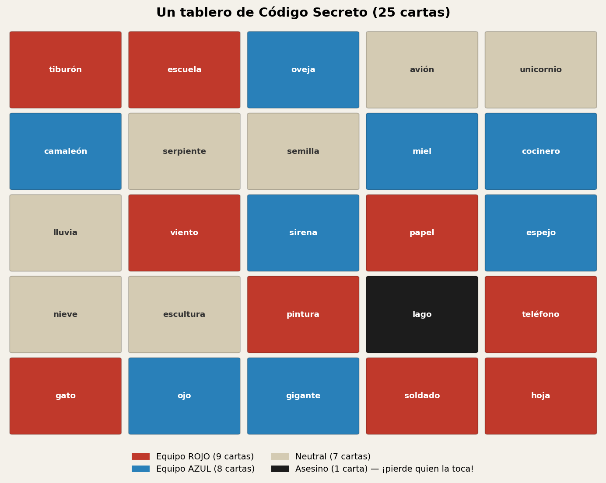
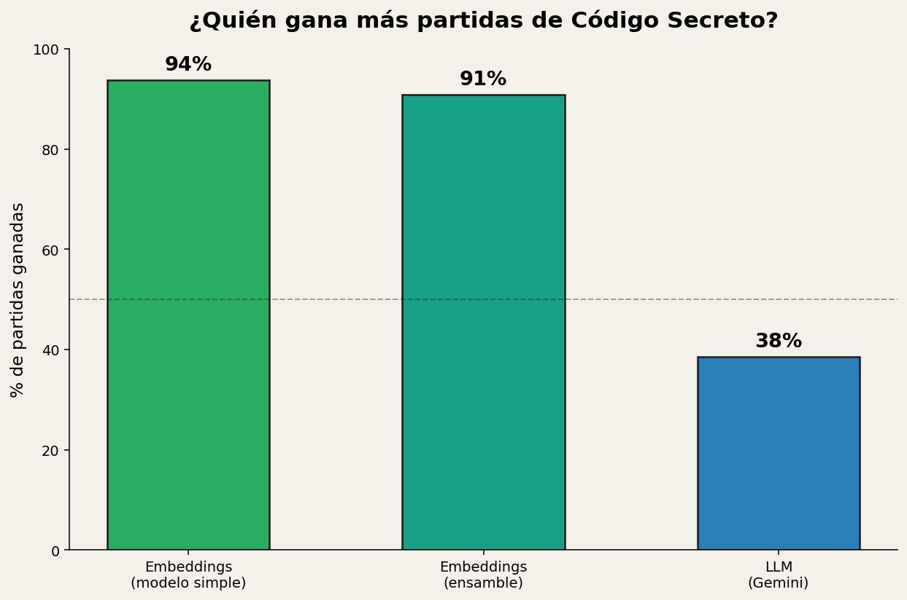
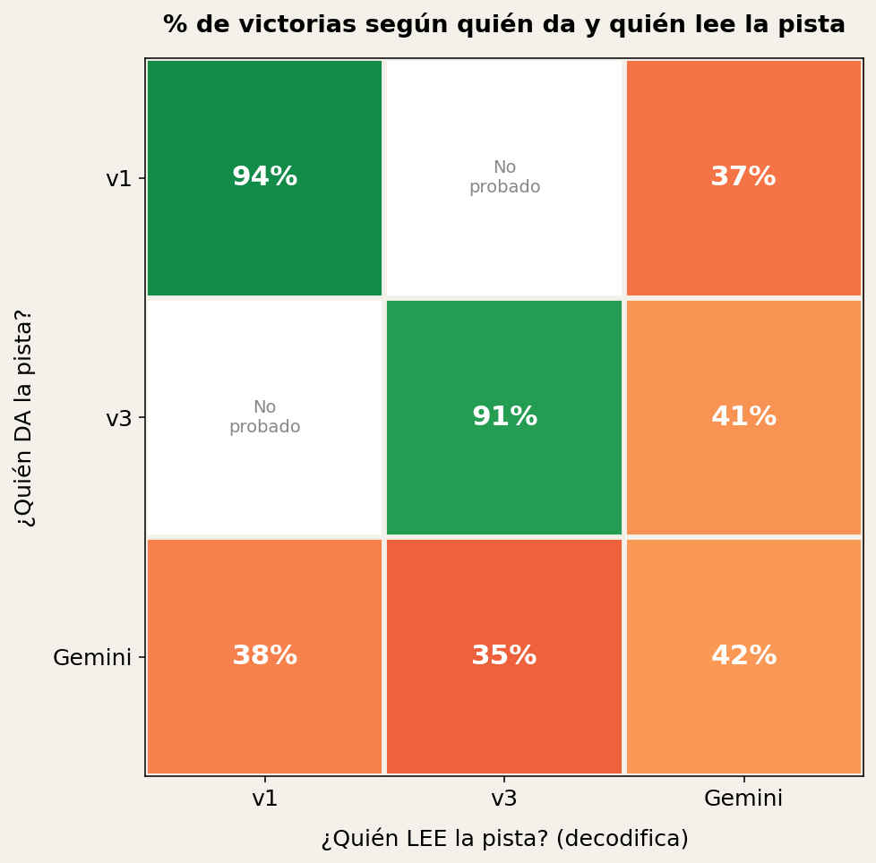
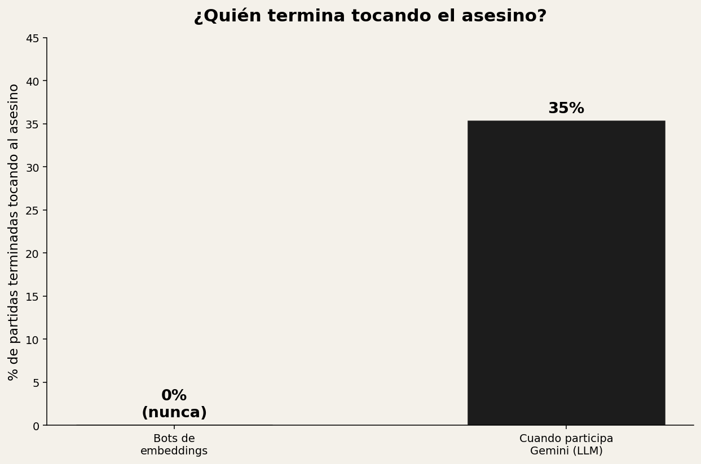

# Un modelo de embeddings simple le ganó a un LLM jugando Código Secreto — casi 6 de cada 10 veces más

*Comparé un algoritmo simple basado en embeddings de palabras contra
Gemini en 490 partidas de Código Secreto (Codenames). El modelo "más
simple" ganó el 93.8% de sus partidas. Gemini, un modelo de lenguaje
mucho más completo y capaz en casi cualquier otra tarea, se quedó en
apenas el 34-41%.*

---

## El juego, en un minuto

**Código Secreto** se juega con un tablero de 25 palabras, repartidas
entre dos equipos. En cada equipo hay dos roles:

- **El que da la pista** (el "Spymaster"): conoce a qué equipo pertenece
  cada palabra, y le da a su equipo una pista de **una sola palabra +
  un número** — intentando conectar la mayor cantidad de palabras
  propias posible.
- **El que lee la pista** (el "Operative"): NO sabe los colores. Solo
  ve la pista y el tablero, y tiene que adivinar cuáles palabras señaló
  su compañero.

| Categoría | Cantidad | Qué pasa si se toca |
|---|---|---|
| Equipo que arranca | 9 | Punto para ese equipo |
| Equipo rival | 8 | Punto para el rival, se pierde el turno |
| Neutral | 7 | Nada, pero se pierde el turno |
| **Asesino** | **1** | **Pierde la partida en el acto** |

La dificultad central: encontrar una pista que conecte varias palabras
propias **sin acercarse** a la palabra asesino — un solo error ahí
termina la partida sin importar cuánto ibas ganando.

## Un ejemplo de cómo se juega un turno

Antes de ir a los resultados, veamos cómo se ve una pista "buena" en la
práctica. En una de mis simulaciones, el tablero tenía estas palabras
(entre otras): `lámpara`, `sol`, `computadora` — las tres del mismo
equipo.

> **Pista: "radiante", número 3**

Las tres palabras comparten algo en común aunque a primera vista no se
note: todas **irradian luz o brillo** — una lámpara, el sol, y la
pantalla de una computadora. El compañero de equipo, viendo solo la
palabra "radiante" y el tablero completo, adivinó las tres
correctamente, sin dudar. Así es como se ve un buen turno: una sola
palabra que conecta varias, sin ambigüedad con nada peligroso.

Ahora sí, veamos qué tan bien juegan distintos "jugadores" a este juego.

## El experimento

Armé dos tipos de "jugador" y los hice competir.

**Un bot basado en embeddings.** Un embedding es, en esencia, convertir
cada palabra en una lista de números (un vector) que representa su
significado — palabras con significados parecidos terminan con vectores
parecidos. Así, podés calcular matemáticamente qué tan relacionadas
están dos palabras (con algo llamado similitud de coseno), en vez de
necesitar que alguien las etiquete a mano. Con eso, el bot recorre miles
de palabras candidatas y elige la que conecta más palabras propias
mientras mantiene, número por número, un margen de seguridad explícito
contra el asesino.

Probé dos versiones de este enfoque:

- **v1**: un solo modelo de embeddings (spaCy, entrenado en español)
- **v3**: un ensamble que combina varios modelos de embeddings distintos
  con un promedio ponderado, pensando que más "opiniones" deberían dar
  más robustez

**Gemini** (un LLM de Google), jugando el mismo rol — dando pistas y
decodificándolas — con un prompt que incluye las reglas exactas del
juego y una instrucción explícita: *"evitá cualquier ambigüedad con el
asesino, incluso si eso significa una pista más chica y segura."*

Corrí un torneo de 490 partidas entre estos tres jugadores (v1, v3, y
Gemini), probando **todas las combinaciones de quién da la pista y
quién la lee** — incluyendo mezclas cruzadas, como "v1 da la pista pero
Gemini la lee", o al revés.

## El resultado

v1 ganó el **93.8%** de sus partidas. v3 ganó **90.8%**. Gemini, en
cualquier combinación donde participó, se quedó entre el **34.6% y el
41.5%**.

Para ponerlo en perspectiva: **v1 — el algoritmo más simple de todo el
proyecto, el primero que armé, sin ningún ajuste extra — le ganó a un
modelo de lenguaje general mucho más capaz, casi 9 de cada 10 veces.**

### ¿Importa quién da la pista y quién la lee?

Como probé todas las combinaciones cruzadas, pude armar esta matriz:
cada fila es quién dio la pista, cada columna quién la leyó, y el valor
es el % de victorias de ese equipo.

Un par de cosas saltan a la vista: v1 y v3 ganan cómodo cuando **ambos
roles** son suyos (93.8% y 90.8%). Pero apenas Gemini entra en escena
—sea dando la pista o leyéndola— el resultado cae a la mitad o menos,
sin importar demasiado cuál de los dos roles ocupe. El problema no está
concentrado en un solo rol: pasa tanto dando como leyendo.

## Por qué: el asesino explica casi todo

**El 35.3% de las 490 partidas terminó con la carta asesino tocada — y
en el 100% de esos casos, fue del lado de Gemini.** v1 y v3 no la
tocaron ni una sola vez en cientos de partidas.

Tiene sentido si pensás en cómo funciona cada uno: el bot de embeddings
calcula, número por número, qué tan lejos está una palabra candidata
del asesino antes de aceptarla como pista — es una regla matemática
dura, no una intuición. Gemini, en cambio, razona en lenguaje natural;
la instrucción de "evitá el asesino" es una sugerencia que compite con
todas las demás asociaciones que el modelo "quiere" hacer, sin ningún
mecanismo que la haga imposible de ignorar.

## Dos partidas reales, para verlo en concreto

**Partida 1** — v1 da la pista, Gemini la lee:

> **Equipo rojo (v1 da la pista)**: *"piloto", número 4*
> Gemini (leyendo) adivina: `helicóptero` ✅, `cohete` ✅, `soldado` ✅,
> **`estación`** 💀 *(la palabra asesino)*

"Piloto" conectando helicóptero, cohete y soldado tiene mucho sentido.
Pero "estación" —pensando en una estación espacial, algo que también
necesita pilotos— le pareció a Gemini una cuarta conexión razonable.
v1 nunca la consideró como parte de su pista (su cálculo matemático la
descartó), pero el espacio semántico de Gemini sí encontró el lazo.

**Partida 2** — Gemini juega ambos roles (da y lee su propia pista):

> **Equipo azul (Gemini)**: pista *"monarquía", número 2*
> → adivina `reina` ✅, **`ajedrez`** 💀 *(la palabra asesino)*

De nuevo: "monarquía" → "ajedrez" es una conexión perfectamente
razonable (el ajedrez tiene reyes y reinas). Es exactamente el tipo de
asociación creativa que hace bueno a un LLM en casi cualquier otra
tarea — y es precisamente lo que lo hace peligroso acá.

## La conclusión

No hizo falta ningún modelo exótico ni mucho ajuste fino: **un algoritmo
simple, con una regla matemática explícita de seguridad, superó
ampliamente a un modelo de lenguaje general mucho más sofisticado**, en
una tarea donde un solo error es catastrófico. La "inteligencia general"
de Gemini —su capacidad de encontrar conexiones creativas y razonables—
es exactamente lo que lo perjudica en un juego donde algunas conexiones,
por más razonables que sean, no se pueden permitir.

Es un recordatorio útil más allá de un juego de mesa: para tareas donde
un error puntual es inaceptable, un sistema simple con reglas de
seguridad explícitas y verificables puede ser mejor apuesta que un
modelo más "inteligente" en general, pero sin ninguna garantía dura.

## El código

Todo el proyecto (motor de juego, los bots de embeddings, la
integración con Gemini, y las herramientas para simular partidas) está
en GitHub:

**[github.com/ianbounos/codenames-bot](https://github.com/ianbounos/codenames-bot)**
